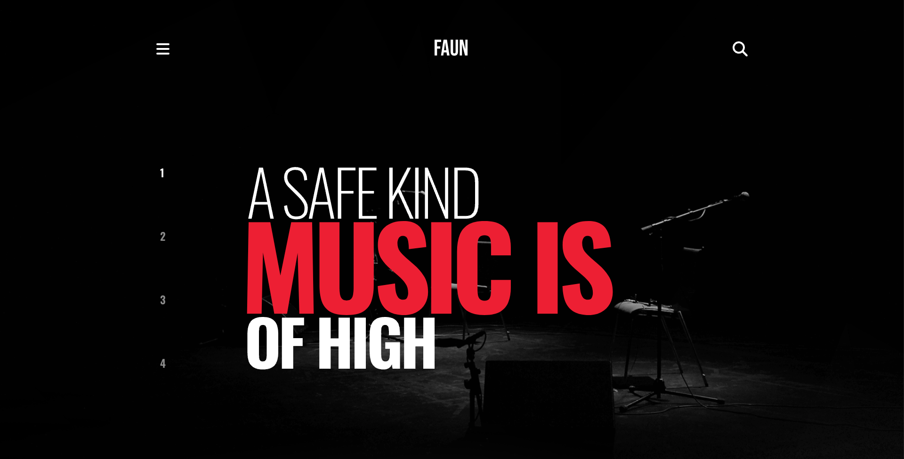

# Band Website

## Band Website using React and Tailwind CSS

<p align="center">
 <a href="#features">Features</a> •
 <a href="#demo">App Preview</a> •
 <a href="#requirements">Requirements</a> •
 <a href="#technologies">Technologies</a> • 
 <a href="#author">Author</a>
</p>

<h4 align="center"> 
	Finished project ✅
</h4>

<h1 id="features">Features</h1>

- [x] Image carousel
- [x] Video placeholder
- [x] Playlists carousel
- [x] Contact form

<h1 id="demo">App Preview</h1>

<h1 align="center">
  
</h1>

<h1 id="requirements">Requirements</h1>

Before starting, you need to install in your machines the following tools:
[Git](https://git-scm.com), [Node.js](https://nodejs.org/en/).
Besides that, is good to have a good code editor as [VSCode](https://code.visualstudio.com/)

## 🎲 Running the App

You can run the app using Codespace container [here](https://leandronunesdev-silver-space-potato-q45qpxvp7qvc9r77.github.dev/)

```bash
# Clone this repository
$ git clone <https://github.com/leandronunesdev/gpac>

# Access the project folder using terminal/cmd
$ cd gpac

# Install the dependencies
$ npm install

# Execute the application on development mode
$ npm run dev

# The server will start on port:5173 - access <http://localhost:5173>

```

<h1 id="technologies">🛠 Technologies</h1>

The following tools were used on this project:

- [Next.JS](https://nextjs.org/)
- [TypeScript](https://www.typescriptlang.org/)
- [Tailwind CSS](https://tailwindcss.com/)

<h1 id="author">🛠 Author</h1>

<a href="https://github.com/leandronunesdev">
 
 <br />
 <sub><b>Leandro Nunes</b></sub></a> <a href="https://github.com/leandronunesdev" title="Leandro">🚀</a>

Made with ❤️ by Leandro Nunes

👋🏽 Reach out!

<a href="https://leandronunes.dev/" target="_blank" rel="noreferrer">Website<a> |
<a href="https://www.linkedin.com/in/leandronunesdev/" target="_blank" rel="noreferrer">Linkedin<a> |
<a href="mailto:nunes.pessoal@gmail.com">E-mail<a> |
<a href="https://twitter.com/leandro_nunes" target="_blank" rel="noreferrer">Twitter<a>
